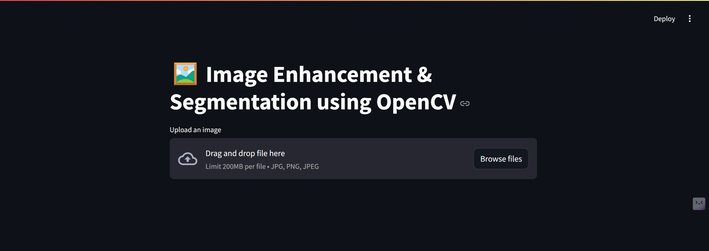
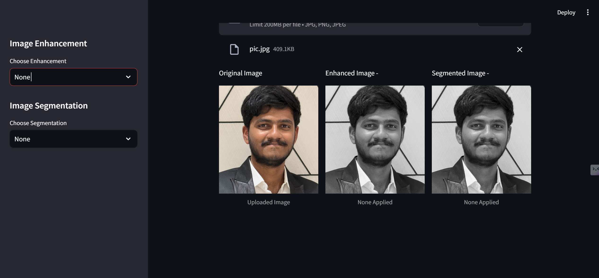
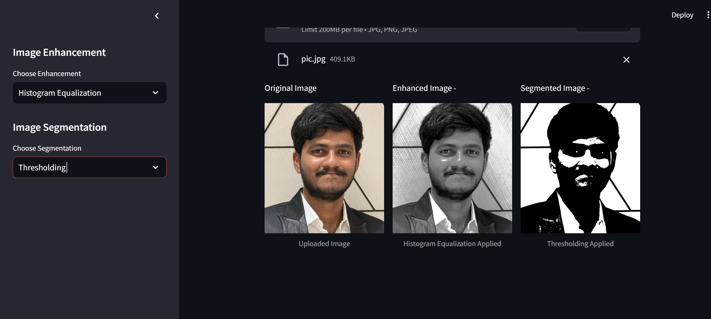
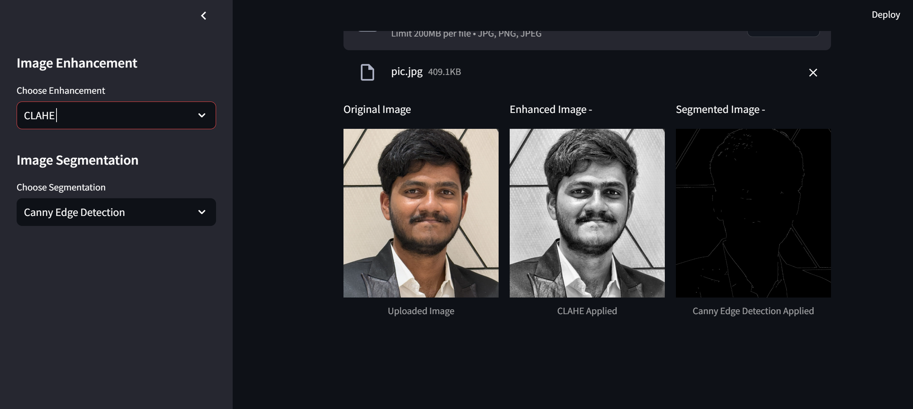
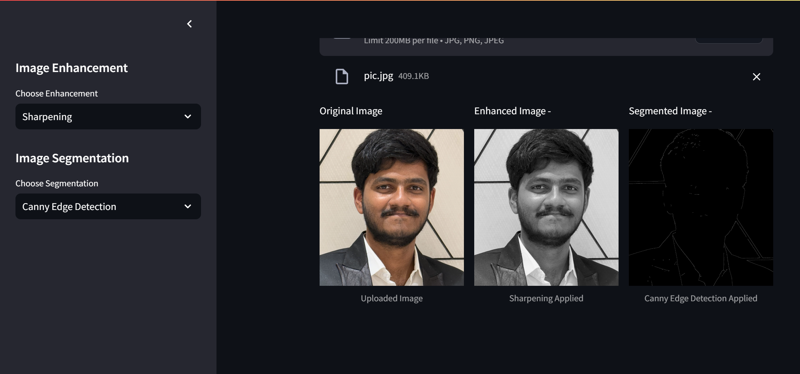

# Image Enhancement and Segmentation

This project provides a web application for image enhancement and segmentation using OpenCV and Streamlit. Users can upload an image and apply various enhancement and segmentation techniques.

## Features

- **Image Enhancement**:

  - Histogram Equalization
  - CLAHE (Contrast Limited Adaptive Histogram Equalization)
  - Sharpening

- **Image Segmentation**:
  - Thresholding
  - Canny Edge Detection

## Requirements

To install the required dependencies, run:

```sh
pip install -r requirements.txt
```

## Usage

To run the application, use the following command:

```sh
streamlit run app.py
```

## File Structure

- `app.py`: Main application file.
- `book.ipynb`: Jupyter notebook (currently empty).
- `requirements.txt`: List of dependencies.
- `img/`: Directory containing sample images.
- `__pycache__/`: Directory containing compiled Python files.
- `.gitignore`: Git ignore file.

## Sample Images

Here are some sample images from the `img` folder:








## How to Use

1. Run the application using the command mentioned above.
2. Upload an image using the file uploader.
3. Choose an enhancement technique from the sidebar.
4. Choose a segmentation technique from the sidebar.
5. View the original, enhanced, and segmented images.

## License

This project is licensed under the MIT License.
